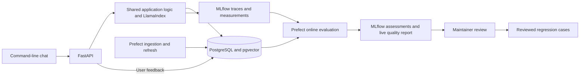

# Ask Phil: agreed design

Status: the user has confirmed the complete design, including the testing and evaluation strategy and public test boundaries. The design interview is complete. The user added feedback and online evaluation as mandatory product requirements on 23 September 2026. The first deterministic evidence-inspection slice is implemented and tested natively and with fresh Docker Compose; [issue #2 evidence](../implementation/issue-2/README.md) records its limits and completed acceptance checks.

## Purpose and experience

- Build an engineering portfolio demonstration using useful questions about EastEnders lore.
- The initial experience is a command-line conversation with an Ask Phil persona styled after Phil Mitchell. R Shiny remains a possible later client.
- Phil is the only persona in the initial demonstration and can answer from the entire supported corpus. Additional voices may reuse the same knowledge, retrieval, and evaluation components later.
- The persona changes wording, not factual accuracy or access to supported lore. Self-serving commentary must preserve the facts and must not minimise serious offences or their harm.
- Every factual answer includes appropriate evidence and a neutral engineering appendix assembled from recorded execution data.
- Follow-up questions may use session history to resolve references, but factual answers retrieve evidence again. Earlier generated answers are not evidence. Include a reset command; persistent personal memory is outside the initial scope.
- There are no spoiler restrictions or audience-reveal-date requirements.
- Users can optionally rate a selected response, add a reason/comment or proposed correction, and receive a reliable feedback receipt. Feedback is associated with the original response/trace and contributes to online evaluation during normal local use.

## Domain and coverage

The [glossary](../../CONTEXT.md) defines the domain language. The [initial roster](../corpus/initial-roster.md) lists the approved 20 core characters and their starting narrative sources.

- Core eligibility means an appearance in the main television series during or after 1990; earlier debuts and relevant earlier history are included.
- Retain evidenced supporting characters outside the core 20, with their more limited coverage made explicit.
- Exclude spin-offs and podcasts initially, including when their material shares a source page with main-series material.
- Expand through the same process towards most notable characters. The roster is a curated selection, not a definitive popularity ranking.
- Prioritise family trees, character connections, marriages, divorces, deaths, crimes, criminal justice involvement, affairs, and scandals.
- Family trees show biological ancestry. Adoptive and step-parent relationships remain represented separately.
- Keep event types, character relationships, and thematic tags distinct. A shared theme alone does not establish a character connection. Defer modelling whole storyline arcs until needed.
- Keep accusations, actual crime commission, convictions, and imprisonment distinct, with participant roles.
- Retain evidenced unclassified facts for text retrieval; make classification gaps visible. Graph coverage can be narrower than source-text coverage.
- Preserve exact, approximate, relative, and unknown event timing without inventing precision.

## Sources and evidence

- Begin with Wikipedia character pages for narrative sources, Wikidata primarily for identity links, and TVmaze for episode metadata.
- Permit clearly attributed source-supported answers. Reserve cross-checked or verified descriptions for facts that have actually undergone the relevant evidence checks.
- Agreement with identifiers or metadata, or repetition of one account, does not establish independent corroboration of a narrative claim.
- Use ordinary HTML/JSON ingestion and LlamaIndex structured claim extraction. Evaluate specialised parsing such as LlamaParse if representative documents expose a need.
- Preserve source-backed claims and their evidence as the underlying knowledge record. Derive graph relationships from claims that pass the agreed checks.
- Keep uncertain claims for qualified explanation without asserting their connections as established graph facts.
- Follow supported corrections in current answers while retaining earlier evidence. Preserve and explain unresolved disagreements.

## Claim admission and review

- Apply automated checks for structure, source support, character identity, relationship meaning, and contradictions.
- Hold ambiguous or conflicting claims for review.
- Thoroughly audit a small initial batch manually, then use targeted review and sampling as coverage grows.
- Passing automated checks does not confer independent cross-checking status.

## Retrieval and routing

All routes answer from a versioned captured source snapshot and the graph derived from that evidence. Live-web browsing during answer generation is outside scope; obtaining new material belongs to ingestion and refresh.

### Routes

- Conventional RAG retrieves supporting source passages.
- GraphRAG queries supported relationships and events, returning the relevant path or structured result with its evidence.
- Agentic RAG performs bounded investigation using the available text and graph tools within the snapshot.

### Fusion and wider source context

The conventional text route adds bounded multi-query RAG-Fusion with reciprocal rank
fusion, followed by source-preserving sentence-window context expansion. Fusion
combines ranked search results; expansion supplies neighbouring source text needed
to interpret those hits. Both stay within the captured snapshot and retain citation
spans. This is a fixed retrieval pipeline, not an agentic or graph route.

Keep original-query retrieval available as the initial baseline and as a visible
bounded fallback. Record query variants, candidates, merged ranks, expanded spans
and final context. Evaluate fusion and expansion independently and together; count
all added latency, calls and truncation loss. The [research note](../research/rag-fusion-and-answer-caching.md)
records the primary-source terminology and implementation choices.

### Repeated-question caching

After the text, refresh and online-evaluation contracts work, add a PostgreSQL-backed
exact-match answer cache for eligible standalone conventional-text questions. Match
the effective request, active snapshot/index, canon/access scope, model/prompts/persona,
retrieval/fusion/context settings and response-policy version. Preserve citations
and evidence context, enforce expiry/capacity, retire incompatible entries and fall
back to ordinary bounded answering when reuse is unavailable.

Follow-ups and graph/investigative requests bypass this first cache. Each cache hit
is a new served response and trace with current measurements and a link to original
generation evidence. It can receive its own feedback and online assessment without
exposing the origin session. Snapshot/configuration changes invalidate compatibility;
TTL is only an additional lifetime bound. Semantic matching of paraphrases remains
a later opt-in extension gated by reviewed false-match and stale-answer checks.

Disable caching for retrieval/model comparisons. Report deliberately cold/warm
workloads separately and isolate evaluation runs/partitions. Final acceptance
includes fresh generation, cache reuse, invalidation and feedback on cached answers.

### Routing policy

- Select routes automatically during normal conversation, with an explicit override for demonstrations and comparisons.
- Check route eligibility, select an available route, check the evidence obtained, and escalate within limits when needed.
- Report the route actually executed, including fallback or escalation.
- Treat multiple routes as potentially valid for one question. Establish answer-quality requirements before optimising cost and latency.
- Compare against always-text-RAG on the same corpus and answer model. Include routing, checking, retries, and investigation in measured costs.

### Initial graph query families

1. Biological ancestry and descendants.
2. Family and romantic relationship histories.
3. Bounded, evidenced connections between two characters.
4. Shared events and participants, including distinct crime and criminal-justice roles.

Defer broad superlatives, such as the character with the most crimes in the entire programme, until coverage justifies the claim. The router must recognise the capabilities of the actual graph tools.

## Incomplete evidence and stopping

- Return supported portions of an answer and explain what remains unanswered.
- Ask for clarification when a character reference remains ambiguous.
- Abstain when the evidence does not support an answer.
- Distinguish not finding a claim or connection in this corpus from establishing that it never happened.
- Stop at configured investigation limits and report the limitation, preserving any supported findings.
- Choose numerical investigation limits during setup alongside the conservative API limit.

## Evidence and execution appendix

| Route used | Evidence shown |
| --- | --- |
| Conventional RAG | Supporting excerpts and source citations. |
| GraphRAG | The relationship chain or structured result, with evidence for its asserted connections. |
| Agentic RAG | A concise record of actual tool calls and findings, plus the resulting text or graph evidence. |

Every answer also shows the route used, source-refresh information, relevant uncertainty, and elapsed time. Detailed inspection can expose the trace, token usage, and estimated model cost where available. Missing measurements must not be presented as zero cost or fabricated confidence.

## User feedback and online evaluation

The [research review](../research/feedback-and-online-evaluation.md) distinguishes online assessment of actual interactions from offline experiments and unreviewed user opinion from factual ground truth.

- Keep the response, evidence, snapshot, route and application/model versions identifiable. PostgreSQL retains feedback revisions and delivery state; MLflow retains distinguishable human, code and judge assessments linked to the original trace.
- Run bounded asynchronous evaluation automatically with the local stack, using Prefect and self-hosted-compatible MLflow APIs. Account explicitly for late feedback, revisions, unavailable trace export and failed/skipped jobs; do not regenerate an answer to score the response the user saw.
- Use every accepted current feedback item in descriptive metrics/triage, with bounded feedback-directed judging and a recorded random sample including unrated interactions. Keep satisfaction, reported errors, automated support findings and source-checked correctness distinct.
- Report eligible/rated/sampled/scored counts, missing/error states, processing lag, cohort/version information and online expense separately from serving and offline evaluations. Do not treat a selected feedback sample as unbiased accuracy or an observational trend as causal improvement.
- Review reports and user/judge disagreements, record dispositions and promote only checked failures into grouped/versioned regression data. No automatic canon changes, model training or prompt/routing changes follow from raw feedback.
- Apply minimal identifiers, controlled access, redaction and configured retention. Feedback is evaluation data, not conversation memory or source evidence. Reset still clears conversational context. No accounts or additional user interface are required.

## Technology and operation

- Use Python, LlamaIndex, FastAPI, PostgreSQL, Docker, Prefect, and MLflow. R Shiny is a possible later interface; Azure and Posit Connect remain future hosting candidates.
- The CLI calls FastAPI, which calls shared application logic. Use Docker Compose for local services so a later Shiny client can use the same backend.
- Initially use PostgreSQL for source records, claims, relationship data, and retrieval vectors. Use pgvector for vector retrieval and custom typed SQL tools for supported graph queries.
- Reconsider a dedicated graph store only when measured requirements justify it; expansion capacity has not yet been benchmarked.
- Run locally first. Trigger source refresh manually initially, then schedule it weekly when deployed, using Prefect for the refresh workflow.
- Distinguish the date sources were checked from any established storyline coverage date.
- Aim for a two-week first working slice. Hours and monetary amounts remain deliberately open; set a conservative API limit during setup.

### Application arrangement

### Delivery sequence

1. Use the confirmed public test boundaries and prepare a small reviewed source/claim/question seed set. Work in behavior slices with failing tests and relevant evaluation cases before the implementation changes they guide.
2. Build a complete, evidence-backed text-RAG path through source capture, retrieval, FastAPI, and the CLI, establishing unit/integration coverage and a single-query baseline. Extend it with evaluated query fusion and wider source context after real-source ingestion.
3. Add the checked graph and the four supported graph query families, preserving evidence for each asserted connection and extending their tests and evaluations.
4. Add bounded investigation and automatic routing, with explicit overrides, recorded execution, and component and end-to-end evaluations.
5. Add optional feedback collection and automatic online evaluation as an independent branch using the existing conversation, trace, limit and evaluation contracts.
6. Add versioned exact-match answer caching once refresh and online evaluation work, including evidence-preserving reuse and feedback on cache hits.
7. Demonstrate the full core roster, grounded follow-ups, refresh, fused text retrieval, cold/warm caching, offline comparisons and the feedback-to-online-assessment-to-review workflow.

All three retrieval routes are required for the completed portfolio demonstration, even though the first working slice starts with one complete text-RAG path.

## Test- and evaluation-driven development

- Maintain a comprehensive suite of unit tests, integration tests, component evaluations, and end-to-end evaluations. Make these part of each development slice.
- Use conventional source-ingestion, document/claim-extraction, retrieval, grounding, citation, and answer-quality measures where applicable, alongside custom domain checks.
- Prepare a small independently reviewed reference set before the first extraction pilot; expand the custom datasets with source cross-checking, failures, and new coverage. No existing dataset has been adopted as ground truth.
- Evaluate parsing and extraction, retrieval/context assembly, graph answers, routing, investigation, final persona answers, and their combined behavior.
- Use calibrated LLM-as-judge evaluations where semantic judgment is appropriate, alongside deterministic checks and reviewed references. Keep factual quality separate from persona style.
- Use MLflow for evaluations, artifacts, and traces; retain ordinary software tests in the test runner/CI workflow.
- Set broader dataset sizes, numeric thresholds, model/provider choices, and specific limits during setup and after initial baselines. The suite and its reviewed seed cases are required from the start.

The [testing and evaluation strategy](testing-and-evaluation.md) specifies confirmed public test boundaries, component metrics, dataset construction and splits, judge calibration, end-to-end comparisons, and execution cadence.

The [candidate demonstration cases](demo-cases.md) provide concrete examples for developing the agreed suite. They have not yet been adopted as gold-labelled data.

## Acceptance criteria

1. The 20 core profiles are ingested, with evidence and coverage limitations visible.
2. All three retrieval routes execute and report their actual evidence and trace.
3. The unit and integration suite passes its public behavioral contracts and failure-handling checks.
4. Component and end-to-end evaluation results are recorded on versioned custom data; reviewed demonstration cases pass factual-support, citation, domain-correctness, and expected-answerability checks.
5. MLflow reports quality, latency, and cost against the fixed-corpus text-RAG baseline, with judge configuration, calibration evidence, and known limitations where judges are used.
6. Ingestion can be rerun reproducibly, and the CLI supports grounded follow-up questions.
7. Optional response-level feedback is collected reliably and used in automatic online evaluations during normal local use, with visible cost/coverage/failure states.
8. Demonstrate a reviewed feedback report and its promotion into a checked regression case without changing canon or contaminating the held-out set.

Grow the broader labelled dataset and establish numerical quality thresholds after the initial baseline, while keeping reviewed seed cases and the test/evaluation workflow in place from the first development slices. These criteria describe the intended result; they have not yet been implemented or tested.

## Explicitly deferred choices

- Specific model/provider selections, package versions, and numerical API or investigation limits: during setup and the pilot.
- Broader labelled evaluation data and numerical quality thresholds: after reviewing the first extraction pilot and before held-out acceptance comparisons; initial reviewed seed data and the test/evaluation workflow are required upfront.
- R Shiny, additional personas, and Azure versus Posit Connect hosting: later delivery stages.
- Broad-corpus performance measurements and any dedicated graph store: when the measured expansion workload warrants them.

## Design confirmation

The user confirmed that the complete design, including the expanded testing and evaluation strategy and its public test boundaries, captures the intended project. There are no remaining design-interview questions. The explicitly deferred setup, pilot, and later-delivery choices remain as listed above.
